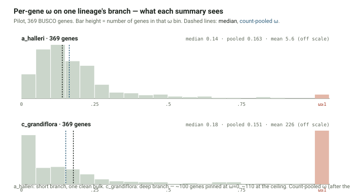
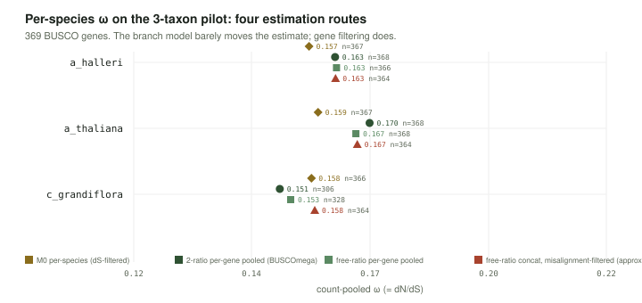

# BUSCOmega

**BUSCO single-copy orthologs → per-lineage dN/dS → a per-species effective
population size (Nₑ) proxy.**

Under nearly-neutral theory, genome-wide dN/dS over conserved genes moves
inversely with Nₑ: a lineage where selection efficiently removes
slightly-deleterious protein changes shows a low ω, a lineage where drift
is stronger shows a higher one. BUSCOmega measures that ω on each species'
own branch of the tree, from hundreds to thousands of BUSCO single-copy
orthologs, and reports one number per species with a confidence interval.


- **Standard-library Python only** — nothing to `pip install`. The heavy
  lifting is done by three validated engines: **MAFFT**, **PAL2NAL**,
  **codeml** (PAML).
- Clade-scoped and data-agnostic: runs from 3 to hundreds of taxa, any
  BUSCO lineage, any annotation source.
- Every stage writes a timestamped log and a manifest of what passed and
  what dropped, with the reason.

The **why** is in [`docs/primer.md`](docs/primer.md); every parameter and
its justification is in [`docs/methods.md`](docs/methods.md); environment
setup and optional add-ons are in [`docs/install.md`](docs/install.md).

---

## Install

MAFFT, PAL2NAL, and codeml are Unix tools with no Windows builds — on
Windows, run everything in WSL2.

```bash
conda env create -f environment.yml       # or: mamba env create -f environment.yml
conda activate buscomega
```

That installs `python`, `mafft`, `pal2nal`, `paml` (`codeml`). BUSCO,
IQ-TREE, and an SVG rasteriser are **optional** add-ons — see
[`docs/install.md`](docs/install.md). No conda? Put the four binaries on
`PATH` any way you like; every stage checks for what it needs at start-up.

---

## Prerequisite: run BUSCO

BUSCOmega starts from BUSCO output. Run BUSCO **in protein mode on
isoform-cleaned proteomes** (one representative protein per gene — e.g. via
[protein-preprocessing-isoform-pipeline](https://github.com/Ludtson/protein-preprocessing-isoform-pipeline)),
one output folder per species:

```
busco_out/
  species_A/ ... /full_table.tsv
  species_B/ ... /full_table.tsv
  ...
```

`prep_optional/run_busco.py` automates this if you need it — see
[`codes/prep_optional/run_busco.md`](codes/prep_optional/run_busco.md).

---

## Quick start

One command runs stages 1 → 7 into a numbered run directory:

```bash
python run_buscomega.py \
    --busco-dir  busco_out/ \
    --prt-dir    proteomes/ \        # one <species>.faa per species
    --cds-dir    cds/ \              # one <species>.fna per species
    --tree       species_tree.nwk \  # topology only; see prep_optional/species_tree.py
    -o           runs/my_clade/ \
    --jobs 16 --threads 3 --batch-size 20 --png
```

`--focal SP` (repeatable) restricts which species get a two-ratio run
(default: every tip in the tree). `--from-stage N` / `--resume` restart a
run that stopped partway. `--dry-run` prints the plan.

Species names come from the BUSCO folder names and must match the
proteome/CDS filenames (`species_A.faa`, `species_A.fna`) and the tree tips.

### Output

```
runs/my_clade/
  01_common_scos/ … 07_ne_proxy/    per-stage outputs + stageN.log + manifests
  07_ne_proxy/
    ne_proxy.tsv        species  omega_pooled  ci_lo  ci_hi  n_genes  …  omega_M0
    per_gene_omega.tsv   every gene, kept or dropped, with the reason
    plots/*.svg          forest plot, per-gene ω distribution, ω vs divergence
  run.log              every stage command + timing
  run_summary.tsv       per-stage counts, params, tool versions, elapsed
  gene_tracking.tsv     one row per gene: where it is, where it dropped out
```

`gene_tracking.tsv` and `run_summary.tsv` are regenerable from the stage
manifests — rerun `run_buscomega.py --from-stage 7` (or just the audit) to
rebuild them.

---

## The estimator (short version)

For species X, the Nₑ proxy is the **count-pooled ω** on X's terminal
branch — pool synonymous and nonsynonymous *sites* and *substitutions*
across all genes, then divide the two rates once:

> ω_X = [Σ(Nɡ·dNɡ) / ΣNɡ] / [Σ(Sɡ·dSɡ) / ΣSɡ]

This is the concatenation-equivalent estimate. It is **not** the mean or
median of the per-gene ω, which are dominated by genes where codeml pins ω
at 0 or its ceiling. Genes with no synonymous signal (`ds_floor`) are
dropped; genes whose dS on a branch exceeds `--ds-ceiling` (default 1.5;
synonymous saturation, or a mis-alignment) are dropped for that branch; the
rest are kept. The CI is a gene bootstrap (`--bootstrap`, default 1000).
Full derivation and the pilot demonstration: [`docs/primer.md`](docs/primer.md)
§8–9.

---

## Validated on a real pilot

3 Brassicaceae (*A. halleri*, *A. thaliana*, *C. grandiflora*), 369 BUSCO
genes, full pipeline run end to end:

| species | pooled ω | 95% CI |
|---|---|---|
| a_halleri | 0.163 | 0.152 – 0.174 |
| a_thaliana | 0.170 | 0.158 – 0.183 |
| c_grandiflora | 0.151 | 0.135 – 0.166 |



**Is the result sensitive to the branch model?** No — 2-ratio and
free-ratio, estimated per gene and pooled the same way, agree to ~2%. What
*does* matter is gene filtering, not the model choice:



Full writeup, including why the naive concatenate route disagrees until
you filter the same genes, and the likelihood-ratio test for whether a
species' ω is actually distinguishable from the fixed model:
[`analysis/findings.md`](analysis/findings.md).

---

## Scope

**Is:** a per-species Nₑ proxy from genome-wide dN/dS over conserved
single-copy orthologs, compared within a clade.

**Is not** (by design): a positive-selection scan (site / branch-site
models), a free-ratio pipeline, an ancestral-lineage tool, a
gene-family/paralog analysis, or an isoform selector. See
[`docs/methods.md`](docs/methods.md) "Scope and boundaries".

---

## Tests

```bash
python -m pytest tests/        # or: for f in tests/test_*.py; do python "$f"; done
```

Eight suites, no external binaries required (MAFFT/PAL2NAL/codeml are faked
in the orchestration tests).

---

## Citation

See [`CITATION.cff`](CITATION.cff). MIT licensed.
