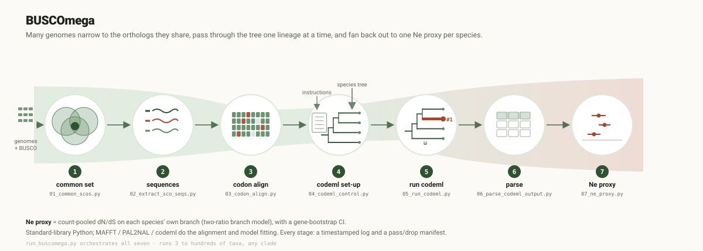

# BUSCOmega methods

Every computational step, every parameter, the reasoning and citation for
each. Written one stage at a time as each is built. See `primer.md` for the
conceptual background this all rests on.

Pipeline shape:



```
[LINGUA Stage 1: cleaned, ID-matched proteomes + CDS]   <- upstream, not part of this tool
        |
   BUSCO (protein mode)   <- prerequisite, prep_optional/run_busco.py
        |
   Stage 1  common single-copy BUSCO set          -> common_scos.tsv
   Stage 2  per-gene multi-species protein + CDS   -> prt/ , cds/
   Stage 3  codon alignments (MAFFT -> PAL2NAL)    -> codon_aln/*.pml
   Stage 4  codeml set-up (M0 + 2-ratio templates) -> ctl/ , trees/ , stage4_analyses.tsv
   Stage 5  run codeml                             -> <analysis>/batch_*/batch.mlc
   Stage 6  parse -> per-gene, per-branch dN/dS    -> <analysis>_records.tsv
   Stage 7  the Ne proxy (count-pooled omega + CI) -> ne_proxy.tsv , plots/
```

In one sentence: BUSCO tables -> which genes are shared and single-copy ->
pull those sequences -> align them -> run codeml per lineage -> parse the
dN/dS numbers -> pool per species = the Ne proxy.

Each stage script runs standalone with its own `-o`. A top-level
orchestrator that runs all seven into one numbered run directory (and
produces `run.log`, `run_summary.tsv`, and the `audit` gene-tracking join)
is a packaging task — see "Output structure" and `WORKING_LIST.md`. Stage 7
already chains 5 -> 6 -> 7 via `--stage5-dir`.

## Script index

| stage | script | status | in -> out |
|---|---|---|---|
| prereq | `prep_optional/run_busco.py` | done | proteome FASTAs + lineage DB -> per-species BUSCO folders (`full_table.tsv`), in parallel, with a manifest + `--resume`. Only run if BUSCO output does not already exist. |
| prereq | `prep_optional/busco_summary.py` | recovered | helper called by `run_busco.py`; scrapes BUSCO summary files to one CSV. |
| prereq | `prep_optional/species_tree.py` | done | clean an existing Newick (`prepare`), suggest a tip-rename map against your real species names (`match` — e.g. an OrthoFinder species tree), or build a supermatrix + run IQ-TREE (`infer`) → a topology for Stage 4. Optional; `infer --run-iqtree` needs IQ-TREE 2. |
| 1 | `core/01_common_scos.py` | done | the `full_table.tsv` files -> `common_scos.tsv` (single-copy in every species + per-species protein ID) + `busco_status_summary.tsv` |
| 2 | `core/02_extract_sco_seqs.py` | done | `common_scos.tsv` + per-species protein & CDS FASTAs -> one protein file + one CDS file per gene, each with all species |
| 3 | `core/03_codon_align.py` | done | per-gene protein + CDS files -> per-gene protein alignments (MAFFT) and codon alignments (`.pml`, PAL2NAL) |
| 4 | `core/04_codeml_control.py` | done | species tree -> labelled trees + one control-file template per analysis (M0, 2-ratio) + the analysis plan |
| 5 | `core/05_run_codeml.py` | done | Stage 4 plan + Stage 3 `codon_aln/` -> per-batch codeml `.mlc` result files |
| 6 | `core/06_parse_codeml_output.py` | done | Stage 5 `.mlc` files -> per-analysis `*_records.tsv` (per-gene, per-branch dN/dS + QC) |
| 7 | `core/07_ne_proxy.py` | done | the `*_records.tsv` -> per-species count-pooled ω + bootstrap CI + plots |
| — | `legacy/merge_busco_table.py` | superseded | old Stage 1, replaced by `01_common_scos.py`; kept for reference |
| — | `legacy/busco_seq_extractor.py` | superseded | old Stage 2 (fuzzy substring ID matching); replaced by `02_extract_sco_seqs.py` |
| — | `legacy/run_mafft.sh`, `legacy/run_pal2nal.sh` | superseded | old Stage 3 (two bash scripts, timestamped outputs, `-nogap -nomismatch`); replaced by `03_codon_align.py` |
| — | `legacy/generate_codeml_control.py` | superseded | old Stage 4 (one timestamp-named `.ctrl` per gene, `cleandata=0`, no 2-ratio); replaced by `04_codeml_control.py` |
| — | `legacy/run_busco.sh` | superseded | old BUSCO runner (sequential loop, or fixed-size `&`/`wait` batches in an earlier variant; no manifest, no resume); replaced by `run_busco.py` |
| — | `not_used_here/sort_phytozome_files.sh` | not this project | organizes a Phytozome download; belongs to the broader toolkit |

---

## Input contract and the single-isoform assumption

BUSCOmega assumes BUSCO was run in **protein mode on isoform-cleaned
proteomes** — one representative protein per gene, standardized headers,
with matched CDS. The recommended upstream step is
`protein-preprocessing-isoform-pipeline` (LINGUA Stage 1), which does exactly
that from GFF + protein FASTA.

**Why one isoform per gene (not tidiness — method):**

1. **Orthology is gene-level.** dN/dS compares orthologous sequence.
   Aligning different isoforms of the same gene across species mixes
   alternative-splicing differences into the comparison, inflating dN or dS
   spuriously.
2. **Consistency across species.** The same representative per gene
   everywhere keeps the comparison apples-to-apples. Longest isoform is the
   standard deterministic choice (OrthoFinder and most comparative genomics)
   and maximizes the alignable region.
3. **It changes BUSCO's own calls.** BUSCO in protein mode against a
   multi-isoform proteome calls a gene `Duplicated` when it matches two
   isoforms of the same gene — a false duplication that drops a usable gene
   from the Stage 1 common set. Running BUSCO on a one-isoform proteome
   prevents this.

**Why BUSCOmega does not take GFF.** GFF is needed to *select* isoforms and
to match protein↔CDS structurally when IDs do not correspond (e.g. NCBI).
BUSCOmega does neither: Stage 1 already yields the exact protein ID per gene
(BUSCO's `Sequence` column), so Stage 2 is an ID lookup, not a structural
problem. A source messy enough that ID matching fails often is a source that
should have been isoform-cleaned upstream — the fix is there, not here.

**Assumed, not enforced (graceful degradation).** BUSCOmega runs on
un-cleaned input; it just guides the user. Stage 1's status summary makes a
suspiciously high `Duplicated` count visible (and prints a note pointing to
the isoform pipeline); Stage 2 does the same on a high drop rate. Same
stance as the isoform pipeline's own README: guide, do not gate.

---

## Running BUSCOmega on your own clade

Nothing in the pipeline is Brassicaceae-specific. Everything scales to the
data you give it: species columns come from `common_scos.tsv`, the
`<ntax>` in the codeml tree header is read off your tree, the number of
codeml analyses is `1 + (focal species)`, and every drop/warn threshold is
a fraction, not a count.

What you supply per clade:

| input | where | example |
|---|---|---|
| BUSCO lineage dataset | prerequisite (`prep_optional/run_busco.py`) | `fungi_odb10`, `vertebrata_odb10`, `viridiplantae_odb10` |
| species tree (topology) | `04_codeml_control.py --tree` | your own Newick, any tip count ≥ 3; `prep_optional/species_tree.py` helps you clean or infer one |
| focal species | `04_codeml_control.py --focal` (default: every tip) | a subset if you only need some lineages |
| genetic code | `04_codeml_control.py --icode` (default `0`, universal) | `--icode 4` for some protists / organellar data |

The one thing that is not auto-handled is whether your proteomes were
reduced to one isoform per gene — see the input contract above. It is
clade-independent, assumed, and warned about, not enforced.

---

## Output structure

One run writes into one directory, with numbered stage subdirectories
(same convention as `protein-preprocessing-isoform-pipeline`):

```
<run_dir>/
  01_common_scos/     common_scos.tsv, busco_status_summary.tsv, stage1.log
  02_sequences/        prt/<id>.faa, cds/<id>.fna, stage2_manifest.tsv, stage2_dropped.tsv, stage2.log
  03_alignments/       prot_aln/<id>.aln, codon_aln/<id>.pml, stage3_manifest.tsv, stage3_dropped.tsv, stage3.log
  04_codeml/           trees/{m0,two_ratio/<sp>}.nwk, ctl/{m0,two_ratio}.ctl,
                       stage4_analyses.tsv, stage4_params.tsv, stage4.log
  05_codeml_out/       <analysis>/batch_NNNN/{batch.pml, batch.ctl, tree.nwk, batch.mlc, genes.txt},
                       stage5_manifest.tsv, stage5_failed.tsv, stage5.log
  06_parsed/           <analysis>_records.tsv  (one per M0 / two_ratio.<sp>)
  07_ne_proxy/         ne_proxy.tsv, per_gene_omega.tsv, plots/*.svg, stage7.log
  run.log              every stage command + timing (from run_buscomega.py)
  run_summary.tsv      every stage's start/done log line, one place
  gene_tracking.tsv    the audit join -- one row per gene, where it dropped out
  stageN.stdout        captured stdout+stderr of each stage subprocess
```

codeml runs are grouped into **batch** directories, not per-gene
directories: one worker processes a batch sequentially in its own directory,
which is what stops codeml's fixed-name scratch files (`2NG.dN`, `rst`,
`rub`, `lnf`) from colliding between concurrent workers. Directory count
scales with the number of batches, not genes.

### The orchestrator

Each stage script also runs standalone with its own `-o` (useful for
re-running one stage). `run_buscomega.py` at the repo root runs all seven
in order into the layout above:

```bash
python run_buscomega.py \
    --busco-dir busco_out/ --prt-dir proteomes/ --cds-dir cds/ \
    --tree species_tree.nwk -o runs/my_clade/ \
    --jobs 16 --threads 3 --batch-size 20 --png
```

It calls each stage as a subprocess (nothing is re-implemented), stops on
the first non-zero exit, and captures each stage's stdout to
`stageN.stdout`. `--from-stage N` / `--to-stage N` run a slice;
`--resume` forwards to Stage 5 so a restarted run skips batches whose
`.mlc` is already complete; `--dry-run` prints the commands.

**`run_summary.tsv`** collects every stage's `stageN.log` start/done lines
(counts, params, tool versions, elapsed) in one file — the start-here file.

**`gene_tracking.tsv`** is the audit join: one row per `busco_id` from the
Stage 1 common set, with columns `stage1 / stage2 / stage3 /
stage5_failed_for / stage7_used_in`, each showing the gene's fate at that
stage (`ok`, `aligned`, `dropped:<step>:<reason>`, or the analyses it
failed / was used in). It is **regenerated**, not mutated — rebuild it any
time from the per-stage manifests (`run_buscomega.py --from-stage 7`, or a
direct call to `build_audit`).

### Gene tracking — regenerated, not mutated

There is **no single master gene table that each stage edits in place.**
That is fragile — a partial failure or a single-stage re-run leaves it
half-written, and it fights the batching/parallel model. Instead:

- Each stage writes its own small manifest (`stage2_manifest.tsv`,
  `stage3_manifest.tsv`, …), keyed on `busco_id`.
- A lightweight `audit` step left-joins those manifests into
  `gene_tracking.tsv` — one row per gene, one set of columns per stage,
  showing where each gene stands and where (if anywhere) it dropped out.
- That view is **regenerable at any point** from whatever manifests exist,
  so it is always consistent with what actually ran and is free to rebuild.

### Summary — one concise top-level file

`run_summary.tsv` at the run root carries, per stage, only the numbers that
matter for "is something wrong": genes in, genes out, dropped, flagged, plus
the parameters used and tool versions. It is the **start-here file** and
points to the detailed per-stage manifests rather than duplicating them.
`busco_status_summary.tsv` (Stage 1) stays as the per-species "which genome
is the weak link" tool.

### Figure output — SVG native, PNG optional

Every plot BUSCOmega emits (Stage 7, and the primer figures) is written as
**SVG**, hand-generated from stdlib — no matplotlib, consistent with the
no-third-party-Python rule. SVG is vector (scales without pixelation),
diffable, and small.

Some workflows and some reviewers want raster. `07_ne_proxy.py --png`
additionally writes PNG copies, by shelling out to whichever SVG rasteriser
is on `PATH` — `rsvg-convert` (from `librsvg`), `inkscape`, or `cairosvg` —
and prints a one-line "install one of these for --png" note if none is
found. PNG is never required to read the results; the SVG is the source of
truth. (For BUSCOmega's own dissertation runs, `--png` is on.)

`librsvg` can be added to the environment with
`conda install -n buscomega -c conda-forge librsvg`; it is left out of
`environment.yml` for the same reason as BUSCO — most users do not need it.

### Run logs and timing

Every stage writes a `stageN.log` in its own output directory — two lines,
one when it starts and one when it finishes:

```
[2026-09-10 11:20:07Z] stage1 start  species=3
[2026-09-10 11:20:08Z] stage1 done  common_scos=369  elapsed_s=0.09
```

UTC timestamps, the key parameters, the headline counts, and wall-clock
`elapsed_s`. The stdout summary line repeats the elapsed time so it is
visible without opening the file. The eventual driver concatenates these
into `run.log` and rolls `elapsed_s` into `run_summary.tsv`.

Per-**gene** timing is off by default (it bloats the manifest) and turned
on with `--time-genes`, which adds a `wall_s` column to `stage3_manifest.tsv`
/ `stage5_manifest.tsv`. It matters most at Stage 5: one codeml gene that
fails to converge can run for minutes, and `wall_s` names the culprit
instead of leaving you to watch a hung batch.

---

## Conventions — parallelization

The heavy stages (3 alignment, 5 codeml) run thousands of small, fully
independent per-gene jobs. Parallelism is exposed through a small, uniform
set of knobs, all with conservative defaults the user scales up:

| knob | meaning | default | applies to |
|---|---|---|---|
| `--jobs` | number of worker processes run concurrently | `1` | every heavy stage |
| `--threads` | threads handed to a *single* tool invocation | `4` | Stage 3 only (MAFFT is threaded; PAL2NAL and codeml are not) |
| `--batch-size` | genes processed per codeml invocation (via PAML `ndata`) | `1` | Stage 5 only |

Total core use is `jobs × threads` at Stage 3 and `jobs` at Stage 5.
Mechanism: `concurrent.futures.ProcessPoolExecutor(max_workers=jobs)`
(stdlib), matching the pattern already used in
`protein-preprocessing-isoform-pipeline`.

**Why codeml has no `--threads`.** PAML is single-threaded — there is no
`--cpu` option in codeml. The only way to give one codeml process more than
one gene is `ndata > 1` (concatenated alignments processed sequentially
within the process), which is what `--batch-size` controls.

**Batching does not change results.** Within an `ndata` batch, codeml
analyses each gene independently — tree, parameters, and likelihood are
reset between datasets. A gene batched with others gives the identical ω to
running it alone. The Stage 6 parser splits on `Dataset N` blocks, so any
batch size is transparent to everything downstream.

**Why `--batch-size 1` by default.** During pilot/validation, one gene per
run means a convergence failure names exactly which gene. For a large
production run once the pipeline is trusted, `--batch-size ~25` cuts
process-spawn and filesystem overhead with no downside.

**Per-job working directory (required).** codeml writes scratch files
(`2NG.dN`, `rst`, `rub`, `lnf`) into the current working directory with
fixed names. Concurrent codeml processes in the same directory clobber each
other, so each worker `cd`s into its own directory before running and it is
cleaned up after.

---

## Stage 1 — common single-copy BUSCO set

**Script:** `codes/core/01_common_scos.py` (stdlib only)

**Input:** a directory with one subdirectory per species, each containing a
BUSCO `full_table.tsv`. BUSCO is expected to have been run in **protein
mode** on the **isoform-cleaned proteomes** (LINGUA Stage 1 output). Running
BUSCO before isoform cleaning would leave the `full_table.tsv` "Sequence"
column pointing at isoform IDs that then need re-mapping in Stage 2; running
it after means those IDs exact-match the proteome, so Stage 2 is a plain
lookup.

**What it does:**

1. For each species, locate the one `full_table.tsv` (errors if a species'
   BUSCO output directory contains more than one — that means an unclean
   re-run and the result would be ambiguous).
2. Parse it. Each data row is `busco_id <TAB> status <TAB> sequence_id ...`
   (a `Missing` row has only `busco_id <TAB> Missing`). Count each of the
   four BUSCO statuses.
3. Keep, per species, `{busco_id: sequence_id}` for **`Status == "Complete"`
   only**.
4. Take the **strict intersection**: a BUSCO id is in the common set iff it
   is `Complete` in *every* input species.

**The `Complete`-only decision.** BUSCO reports four statuses:

| status | meaning | kept? |
|---|---|---|
| `Complete` | found once, full length | **yes** |
| `Duplicated` | found more than once, full length | no |
| `Fragmented` | found, but partial | no |
| `Missing` | not found | no |

`Complete` is BUSCO's term for *single-copy and complete*. We require single
copy because a duplicated gene in even one species means the alignment for
that gene would put a paralog against single-copy orthologs elsewhere — the
resulting ω is then a mix of ortholog and paralog divergence, which is a
different quantity from what the Ne proxy needs. `Fragmented` is excluded
because a partial sequence gives a short, unrepresentative alignment.
(BUSCO documentation: Manni et al. 2021, *Mol. Biol. Evol.*; Simão et al.
2015, *Bioinformatics*.)

**The strict-intersection decision.** Every gene in the common set has every
species, so a single unrooted species tree fits all of them and Stages 3–5
need no per-gene tree handling. Relaxing to "present in ≥ N species" is a
legitimate option for datasets with one or two lower-quality genomes, but it
forces per-gene tree pruning downstream (codeml's tree must match the taxa
actually in each alignment). That option is **deferred**, not built — it is
noted here so the choice is explicit.

**Outputs** (into `--out-dir`):

- `common_scos.tsv` — header `busco_id` then one column per species;
  one row per common gene; each cell is that species' matched protein ID.
  This is the direct input to Stage 2.
- `busco_status_summary.tsv` — one row per species:
  `complete duplicated fragmented missing total in_common_set
  sole_block_dup sole_block_frag sole_block_missing recoverable`.

  The raw counts show whether a species underperforms. The **sole-blocker**
  columns show whether that underperformance actually *costs* anything: a
  species' non-`Complete` call for a gene only removes that gene from the
  common set if the gene is `Complete` in **every other** species — then
  that one species is the sole blocker, and the gene is *recoverable* (a
  better assembly/annotation for that species would add it back). If the
  gene was also non-`Complete` somewhere else, that species is not uniquely
  responsible (shared loss) and it is not counted here.

  `recoverable` = `sole_block_dup + sole_block_frag + sole_block_missing` =
  how many genes you would gain by fixing just this one species. This is the
  number that decides whether a genome is worth swapping: a species with a
  low `complete` count but a low `recoverable` count is not the problem; a
  high `recoverable` count is.

  Pilot example (real data): a_thaliana `recoverable` = 3 (reference genome,
  essentially pristine); a_halleri = 30 (11 dup + 4 frag + 15 missing — the
  weak link); c_grandiflora = 21 (16 of them fragmentation). Common set is
  369; a better a_halleri assembly alone would push it toward ~399.

  Not yet implemented: a *fragment-rescue* option. BUSCO's `full_table.tsv`
  carries a `Length` column; compared against the lineage's per-marker
  expected length (`lengths_cutoff` in the lineage dataset), a `Fragmented`
  hit that recovered most of its length is still usable in an alignment. A
  `--rescue-fragments <pct>` flag could pull such near-complete fragments
  into the common set. Deferred because a rescued fragment gives a shorter,
  gappier alignment for that gene and therefore a noisier ω — a tradeoff to
  make deliberately, per run, not by default.

**Two lineages, two purposes.**

- **Pilot / build & test → `viridiplantae_odb10`** (~425 markers). This is
  what the existing 3-species pilot BUSCO output already uses (`at33090` =
  Viridiplantae taxid in the gene IDs). No BUSCO re-run needed. Common
  single-copy set across the 3 pilot species: order of 300–400.
- **Chapter 3 run → `brassicales_odb10`** (4,596 markers; verified from
  `scores_cutoff` in `brassicales_odb10.2024-01-08.tar.gz` — the earlier
  "~665" was wrong). Common single-copy set across 21 Brassicaceae + 2
  outgroups: expected ~1,500–2,500 (the non-Brassicaceae outgroups fail the
  most brassicales-specific markers).

**Compute scale (Stage 4/5).** At 2-ratio, one codeml run per gene per focal
species. Pilot: ~350 genes × 3 species ≈ 1,400 runs, minutes. Chapter 3:
~2,000 genes × 21 ingroup species ≈ 44,000 runs — but each run is a
single-threaded, few-second job with tiny memory, and they are fully
independent. On a 24-thread workstation that is an overnight job; on a
32–64-core machine, a few hours. Not a scheduler-queue job.

**Format currency.** The `full_table.tsv` layout (`# Busco id`, `Status`,
`Sequence`, then score/length/coords/url/description) and the four `Status`
values have been stable since BUSCO v3. Verified against both the pilot
output (BUSCO v5.1.2, `viridiplantae_odb10`) and the current release
(BUSCO v6.1.0, `odb12.2`) — a fresh run differs only in the lineage name in
the path and the gene-ID taxid suffix. The script reads only columns 0–2 and
matches the four status strings, so it is version-agnostic.

**Test:** `tests/test_common_scos.py` runs the script against
`tests/fixtures/stage1_busco/` (a synthetic 3-species `full_table.tsv` set
built to exercise every filter branch: Complete-in-all, Duplicated in one,
Missing in one, Fragmented in one) and checks both output tables exactly.

**Pilot result (real data).** Run on the 3 pilot species' protein-mode
`full_table.tsv` (`examples/pilot_busco/`): 393 / 421 / 402 Complete per
species, **369 common single-copy genes** (the older pipeline got 368).
`a_thaliana` is cleanest (reference genome); `a_halleri` carries more
duplicates/missing; `c_grandiflora` more fragmented — none disqualifying.

**Not this script's job:** running BUSCO (that is `prep_optional/run_busco.py`,
a prerequisite), and pulling the actual sequences (Stage 2).

---

## Stage 2 — sequence extraction

**Script:** `codes/core/02_extract_sco_seqs.py` (stdlib only). The old
`busco_seq_extractor.py` is in `codes/legacy/` — it read a different Stage 1
format and matched IDs by fuzzy substring, which can silently pull the wrong
sequence; this is a rewrite, not an adaptation.

**Input:** `common_scos.tsv` (Stage 1) + `--prt-dir` (one `<species>.faa`
per species column) + `--cds-dir` (one `<species>.fna`).

**What it does**, per common gene, per species:

1. **Protein** — exact lookup of the ID Stage 1 recorded, in that species'
   proteome. Stage 1 took the ID straight from BUSCO's `Sequence` column, so
   this is always an exact hit for a well-formed input.
2. **CDS** — exact lookup first; then retry after stripping one of a small
   built-in suffix set (`.p`, `.P`, `-p`, `-P`, `.cds`, `.CDS`) plus any
   passed via `--cds-suffix-strip`; then give up. **Never a fuzzy guess.**
   The rule that matched is logged per species — it should be the same rule
   for every gene of a species; a mix is a red flag.
3. **Length check** — `|cds_len − 3·protein_len| ≤ max(3, 2%·3·protein_len) +
   3` (the `+3` tolerates an optional stop codon). Outside that, the wrong
   CDS was probably paired; the gene-species pair is **flagged in the
   manifest but not dropped** — PAL2NAL at Stage 3 is the hard gate.
4. **Drop policy** — if any species is missing its protein *or* CDS for a
   gene, the **whole gene is dropped** (logged with the reason), preserving
   the invariant that every retained gene has every species.

**Why no GFF.** See "Input contract" above — Stage 1 already pins the exact
protein ID, so this is an ID-lookup problem, not the structural
isoform-selection problem GFF is for.

**Outputs** (into `--out-dir`):

- `prt/<busco_id>.faa`, `cds/<busco_id>.fna` — one record per species,
  header `>{species} {busco_id}`, species in the `common_scos.tsv` column
  order. These feed Stage 3.
- `stage2_manifest.tsv` — long format, one row per gene-species:
  `busco_id species protein_id cds_id prt_len cds_len cds_len_ratio
  match_rule length_flag`.
- `stage2_dropped.tsv` — `busco_id reason`.
- A high drop rate (>5%) or high flag rate (>10%) prints a note pointing to
  the isoform pipeline.

**Pilot result (real data).** `examples/pilot_busco_stage1_out/common_scos.tsv`
+ `examples/pilot_proteomes/`: **369 / 369 genes written, 0 dropped, 0 length
flags.** Match rules: `a_halleri` exact, `a_thaliana` exact, `c_grandiflora`
`strip:.p` (Phytozome protein IDs carry a `.p` the CDS IDs lack — the exact
case the strip rules exist for). Output in `examples/pilot_stage2_out/`.

**Test:** `tests/test_extract_sco_seqs.py` against `tests/fixtures/stage2/` —
a 4-gene, 3-species fixture covering exact match, suffix-strip match, a
whole-gene drop (one species missing its CDS), and a length-flag (wrong CDS
paired).

---

## Stage 3 — codon alignment

**Script:** `codes/core/03_codon_align.py` (stdlib only). It replaces two
bash scripts, `run_mafft.sh` and `run_pal2nal.sh`, now in `codes/legacy/`.
The rewrite is one script (one manifest, one dropped log, one set of
conventions), keys every output on the gene ID instead of a run timestamp,
and — the substantive change — runs PAL2NAL **without `-nogap` and without
`-nomismatch`** (see below).

**Input:** the Stage 2 `--out-dir`, i.e. a directory holding `prt/` and
`cds/`.

**What it does**, per gene:

1. **Strip a trailing stop.** A `*` (or `.`) at the end of a protein makes
   MAFFT unhappy and is not part of the alignable protein; it is removed
   before alignment. The CDS is left untouched — PAL2NAL handles a trailing
   stop codon.
2. **Align proteins** — `mafft --auto --inputorder --thread <T>`.
   `--auto` lets MAFFT pick L-INS-i / FFT-NS-2 / etc. by problem size;
   `--inputorder` keeps the output in the same species order as the input
   so every downstream file lines up.
3. **Project onto codons** — `pal2nal.pl <prot_aln> <cds> -output paml`.
   Output is PAML sequential format, ready for codeml.
4. **Drop, never truncate.** A gene is dropped and logged if: it has fewer
   than 3 records on input; MAFFT exits non-zero or writes nothing; PAL2NAL
   exits non-zero or writes nothing; or the codon alignment comes back with
   fewer taxa than went in. A dropped gene leaves no partial file behind.

### Why no `-nogap` and no `-nomismatch`

Both flags let PAL2NAL quietly change the data, and both decisions are
better made once, later, in one place.

- **`-nogap`** removes every alignment column that contains a gap in any
  sequence. Doing it here would mean gap-handling happens twice and
  inconsistently — once as PAL2NAL column removal, once inside codeml — and
  the pilot showed exactly that failure: the M0 run used `cleandata = 0`
  while the free-ratio run used `cleandata = 1`, so their branch lengths
  and ω were not comparable. Stage 3 keeps all columns; codeml removes
  gapped columns once, the same way for every model (`cleandata = 1`,
  set at Stage 4).
- **`-nomismatch`** tells PAL2NAL that when a codon does not translate to
  its aligned amino acid, it should silently delete that codon and carry
  on. A translation mismatch is not noise to be trimmed — it means the
  wrong CDS was paired, or there is a frameshift, or the wrong genetic code.
  Without the flag, PAL2NAL exits with an error naming the offending
  sequence; this script catches that, drops the gene, and records the
  reason in `stage3_dropped.tsv`. A handful of such drops is normal; many
  means a systematic input problem.

### How codeml handles gaps, and why complete-deletion is the right default here

codeml's `cleandata` option controls this:

- **`cleandata = 1`** (what this pipeline uses) — before estimating
  anything, codeml deletes every codon column that has a gap or an
  ambiguity character in *any* sequence. The whole fit runs on
  complete-data columns only.
- **`cleandata = 0`** — those columns are kept, and each gap is treated as
  "missing data" for that one sequence (the likelihood sums over the
  states it could have been).

Complete-deletion is the more defensible default for a dN/dS study for four
reasons:

1. **A gap is an indel, not a substitution.** dN/dS is a ratio of
   *substitution* rates; the model describes one nucleotide changing into
   another. A gap is the absence of homologous sequence, produced by a
   different process. Feeding indel regions to a substitution model asks it
   to interpret something it was not built for.
2. **Alignment error concentrates at gaps.** The columns beside an indel
   are where the aligner is least sure it matched the right residues. A
   misaligned column there can register as a nonsynonymous difference that
   never happened, inflating dN. Dropping gapped columns removes the least
   trustworthy part of the alignment.
3. **`cleandata = 0` still trusts the flanking alignment.** Treating a gap
   as missing still uses that column's position and the other species'
   codons there; bad alignment still leaks in, just less visibly.
4. **Comparability across lineages.** With deletion, every branch's ω for a
   gene is estimated from the identical set of sites. With `cleandata = 0`,
   different parts of the tree effectively see slightly different data
   depending on which species are gapped where — bad for a study whose
   whole point is comparing ω across lineages.

**The caveat, and why the pilot checks it.** A gap in any one species kills
the column for all species. At 3 taxa that costs almost nothing. At 23 taxa
it compounds: more species means more chances that some species is gapped
at any given column, so complete-deletion can discard a large fraction of a
gene. Before the full Brassicaceae run, `03_codon_align.py`'s `gap_frac`
column and a codeml test run are used to measure how many sites actually
survive `cleandata = 1` at 23 taxa. If retention is poor, `cleandata = 0`
becomes the pragmatic fallback and that choice is recorded with the run.

**Outputs** (into `--out-dir`):

- `prot_aln/<busco_id>.aln` — MAFFT protein alignment (FASTA).
- `codon_aln/<busco_id>.pml` — PAL2NAL codon alignment (PAML sequential).
  These feed Stage 4.
- `stage3_manifest.tsv` — one row per surviving gene: `busco_id n_taxa
  prot_aln_aa codon_aln_bp gap_frac mafft_rc pal2nal_rc`. `gap_frac` is the
  fraction of gap characters across the whole codon alignment — the number
  to watch when deciding `cleandata` for a larger taxon set.
- `stage3_dropped.tsv` — `busco_id step reason`, where `step` is one of
  `input` / `mafft` / `pal2nal`.
- A drop rate above 5% prints a note to stderr.

**Parallelism.** `--jobs` genes are aligned concurrently
(`ProcessPoolExecutor`); `--threads` is passed to each MAFFT call (PAL2NAL
is not threaded). Each gene runs in its own temp directory, cleaned up
after. See "Conventions — parallelization".

**Pilot result (real run).** `examples/pilot_stage2_out/` (369 genes, 3
species) through `03_codon_align.py --jobs 8 --threads 1`, MAFFT 7.526 +
PAL2NAL 14.1 in the `buscomega` conda env: **369 / 369 aligned, 0 dropped,
every tool exit code 0.** Wall time ~54 s on 8 workers (MAFFT `--auto`
picks L-INS-i for these small inputs; process spawn is a large part of
that). `gap_frac` across the 369 codon alignments: median 0.7%, mean 2.2%,
max 43% — 23 genes above 10%, 4 above 20%. At 3 taxa this costs almost
nothing under `cleandata = 1`; the same distribution at 23 taxa is what the
Phase 2 retention check has to look at. Output kept in
`examples/pilot_stage3_out/` (both alignment sets + manifests, ~4 MB) so
Stage 4 can be built without re-running MAFFT.

**Running it (in the `buscomega` conda env, on a machine with the
binaries):**

```bash
conda activate buscomega
python codes/core/03_codon_align.py 02_sequences/ -o 03_alignments/ \
    --jobs 8 --threads 3
```

**Test:** `tests/test_codon_align.py` against `tests/fixtures/stage3/` — a
4-gene fixture where `run_mafft` and `run_pal2nal` are replaced with fakes
(the binaries are not assumed present in CI). It covers a clean gene, a
PAL2NAL translation mismatch, a missing CDS file, and a MAFFT failure —
one drop per `step` value — plus the PAML-format gap-fraction parser and
the stop-stripper as unit tests.

---

## Stage 4 — codeml analysis set-up

**Script:** `codes/core/04_codeml_control.py` (stdlib only). It replaces
`generate_codeml_control.py` (now in `codes/legacy/`), which wrote one
timestamp-named `.ctrl` per gene, defaulted `cleandata=0`, and had no
branch model.

**Two analyses per gene:**

| analysis | codeml | gives you |
|---|---|---|
| **M0** | `model=0 NSsites=0` | one ω for the whole tree — the genome-wide dN/dS used as the Ne proxy, and the null for an LRT |
| **2-ratio** | `model=2 NSsites=0`, focal tip = `#1` | that lineage's own terminal-branch ω against a shared background. One run per focal species. |

Not free-ratio (`model=1`) — a separate ω on every branch is too many
parameters for single-gene alignments and the estimates are noisy. Not
branch-site — that tests for positive selection *at sites on* the focal
branch, which is a different question from "what is this lineage's ω".

### Why a template, not a file per gene

`seqfile` changes every gene; the tree and every model parameter do not.
One `.ctl` per gene per analysis is 369 × 4 files for the pilot and
~100,000 for the full 21+2 run — that many near-identical small files is a
filesystem problem, not a feature. Stage 4 writes **one template per
analysis** with `seqfile` / `treefile` / `outfile` / `ndata` left as
`__PLACEHOLDER__` tokens, plus a plan table. Stage 5 fills the placeholders
per gene batch by calling `write_control()` imported from this module — not
by editing text.

### The tree

Input is a Newick species tree; **only the topology is used** — codeml
re-estimates every branch length (`fix_blength=0`). Unrooted. Branch
lengths and support values on the input are stripped.

`04_codeml_control.py` writes, into `04_codeml/trees/`:

- `m0.nwk` — topology, no labels
- `two_ratio/<species>.nwk` — one per focal species, that tip tagged ` #1`

**Every tree file carries a leading `<ntax> 1` header line** (e.g. `3 1`
for the pilot). The first number is the tip count, read off the tree — not
hardcoded, it follows whatever tree you give. The second, `ntrees`, is
fixed at **1** on purpose and is not a user knob: every gene in a BUSCOmega
run has the identical species set and topology (the Stage 2 invariant), so
there is never a reason to supply a different tree per gene. `ntrees=1`
tells codeml to reuse the one tree for every dataset in an `ndata` batch.
Without the header, a batched run (a) silently misreads — every dataset
gets tree #1's result — and (b) exits non-zero. Verified on PAML 4.10.x
with the pilot data:

| tree file | `ndata=3` result |
|---|---|
| plain Newick | exit 1, all 3 datasets report gene 1's ω |
| `3 1` header + Newick | exit 0, each gene its own correct ω |

**codeml's exit code is not a reliable success signal** — even a clean
single-gene run returns `1` in this build unless the tree header is
present, and other conditions can flip it too. Stage 5 therefore judges a
run by whether the `.mlc` parses into the expected number of dataset
blocks (the Stage 6 parser is the gate), not by `$?`.

### Foreground labelling

`#1` is inserted after the bare tip token, bounded by `(` `,` `)` `;` — so
a species whose name is a substring of another (`sp1` vs `sp10`) is still
matched exactly once. The script asserts exactly one `#1` per 2-ratio tree
and an unchanged tip count.

### Model parameters

Fixed in every template, overridable by flag: `CodonFreq=2` (F3X4),
`icode=0` (universal), `fix_kappa=0 kappa=2`, `fix_omega=0 omega=0.4`, no
among-site rate variation (`fix_alpha=1 alpha=0` — that is site-model
territory), `cleandata=1`. Recorded in `stage4_params.tsv` for the audit.
`--cleandata 0` is allowed but prints a warning — M0 and 2-ratio must use
the same value or their ω are not comparable (this was the pilot's
non-comparability bug).

**Cross-check.** With `--stage3-dir`, the tree's tip set is compared to the
species in the Stage 3 codon alignments; a mismatch aborts Stage 4 with the
offending names, because a wrong topology biases every gene's ω.

**Outputs** (into `-o`, default `04_codeml/`):

- `trees/m0.nwk`, `trees/two_ratio/<species>.nwk`
- `ctl/m0.ctl`, `ctl/two_ratio.ctl` — the templates
- `stage4_analyses.tsv` — `analysis type model nssites treefile ctl_template`,
  one row per analysis (pilot: 1 + 3 = 4; Phase 2: 1 + 21 = 22). Stage 5's
  input.
- `stage4_params.tsv` — the parameter choices
- `stage4.log` — timestamped start/done line with counts and elapsed

**Getting a species tree** (Stage 4 requires one — it is a scientific
choice, not something to auto-infer). The optional helper
`prep_optional/species_tree.py` covers both routes; see
`prep_optional/species_tree.md`.

- **Have a tree** (from the literature — for Brassicaceae, Nikolov et al.
  2019; Walden et al. 2020; Hendriks et al. 2023): `species_tree.py
  prepare` strips branch lengths / support / annotations, and `--rename`
  reconciles published tip names (`Arabidopsis_thaliana`) to your data
  names (`a_thaliana`). Stdlib only.
- **No tree**: `species_tree.py infer` concatenates the Stage 3 protein
  alignments into a supermatrix + partition file, and with `--run-iqtree`
  runs a partitioned ML search (needs IQ-TREE 2, which is outside the
  `buscomega` env). A few dozen taxa: minutes to about an hour.

Note either route produces a **plain topology Newick with no `<ntax> 1`
header** — no tree file carries that line. Stage 4 adds it (and the ` #1`
labels) when it writes `04_codeml/trees/`.

**Pilot result (real run).** `04_codeml_control.py --tree
examples/3species_pilot/species_tree.nwk --stage3-dir examples/pilot_stage3_out`:
4 analyses planned (M0 + one 2-ratio per species), `cleandata=1`, tip set
matches the data. Output in `examples/pilot_stage4_out/`. Verified
end-to-end against codeml (PAML 4.10.x, `buscomega` env): the generated
templates + trees, with `ndata=4` batches of real pilot genes, give exit 0
and correct per-gene ω for both M0 (e.g. 0.099 / 0.140 / 0.055 / 0.358) and
2-ratio (foreground/background pairs per gene).

**Test:** `tests/test_codeml_control.py` — the Newick helpers (topology
strip, tip extraction, substring-safe `#1` labelling), `write_control()`
for both model families and the `cleandata` override, a full pilot run
(4 analyses, `cleandata=1`, headers, plan table), a focal-subset run, and
the tree/data mismatch abort.

---

## Stage 5 — run codeml

**Script:** `codes/core/05_run_codeml.py` (stdlib only). Replaces
`run_codeml.sh` (`codes/legacy/`), which batched by concatenation but keyed
outputs on timestamps, trusted codeml's exit code, and shelled every step.

**Input:** the Stage 4 out-dir (`stage4_analyses.tsv` + `ctl/` + `trees/`)
and the Stage 3 `codon_aln/` directory.

**Per (analysis × batch of `--batch-size` genes):**

1. concatenate the batch's `.pml` into `batch.pml` (`ndata` = batch size)
2. copy the analysis's tree in as `tree.nwk` (it already has the
   `<ntax> 1` header from Stage 4)
3. fill the four placeholders in the Stage 4 template — via
   `fill_template()`, string substitution, no text editing of a rendered
   file — into `batch.ctl`
4. run `codeml batch.ctl` with `cwd` set to that batch directory, so
   codeml's fixed-name scratch files (`2NG.*`, `rst`, `rst1`, `rub`,
   `lnf`) stay contained and concurrent workers never collide

**Success = output, not exit code.** codeml in PAML 4.10.x returns
non-zero on clean runs. A batch is "ok" only when its `.mlc` holds one
result block per gene (`Dataset N` / `CODONML` count). A batch that comes
up short is **retried one gene at a time** into `batch_NNNN/retry/<id>.mlc`;
genes that still produce nothing go to `stage5_failed.tsv` and the rest are
kept. Stage 6 reads whatever `.mlc` files exist under an analysis, batched
or salvaged.

**Parallelism:** `--jobs` batches run concurrently
(`ProcessPoolExecutor`); `--batch-size` genes per codeml call. Batching is
result-neutral — codeml resets tree, parameters and likelihood between
datasets — so any batch size gives the same ω as `--batch-size 1`; it only
trades process-spawn overhead for a coarser failure unit. Default is 1
(a failure names its gene directly); raise it once the run is trusted.

**Outputs** (into `-o`, default `05_codeml_out/`):

- `<analysis>/batch_NNNN/` — `batch.pml`, `batch.ctl`, `tree.nwk`,
  `batch.mlc`, `codeml.log`, codeml scratch files
- `<analysis>/batch_NNNN/retry/<id>.mlc` — salvaged single-gene runs
- `stage5_manifest.tsv` — `analysis batch n_genes n_ok n_datasets status
  wall_s mlc`
- `stage5_failed.tsv` — `analysis busco_id reason`
- `stage5.log`

**Pilot result (real run).** Stage 4 pilot output + Stage 3 `codon_aln/`
(369 genes), `--batch-size 20 --jobs 8`, `buscomega` env (PAML 4.10.10):
**1,476 / 1,476 gene-analyses (369 genes × 4 analyses), 0 failed, ~470 s**
on 8 workers. Per-analysis wall time: M0 289 s, 2-ratio `a_halleri` 894 s,
`a_thaliana` 827 s, `c_grandiflora` 1,583 s. Output in
`examples/pilot_stage5_out/` (manifests, all four parsed record tables, one
sample batch dir).

**A finding worth carrying into Stage 7.** Feeding these through the Stage 6
parser, M0 branch records are almost all clean (6 / 1,476 QC-flagged), but
the 2-ratio foreground estimates are noisier the more diverged the focal
lineage is: `a_halleri` / `a_thaliana` foreground ≈ 1 % flagged, but
**`c_grandiflora` foreground ≈ 23 %** (`omega_boundary` + `ds_floor` of
1,476). Per-lineage per-gene ω summary statistics on the same data: mean
5.6 / 3.0 / **226**, median 0.14 / 0.15 / 0.18, count-pooled **0.163 /
0.170 / 0.151** (after the dS-ceiling filter). The mean is destroyed by the
ω-ceiling cases; the pooled estimator (near the median here) is the
principled one and its dS-ceiling step removed a genuinely broken gene
(a_halleri had one with dS ≈ 70). **`primer.md` §8–9 works this through
from the ground up with figures** — the reference for why Stage 7 pools
sites and substitutions rather than averaging ratios, keeps
`omega_boundary` genes, drops `ds_floor` genes, and applies a dS ceiling.

**Test:** `tests/test_run_codeml.py` — `_one_codeml` is faked to report a
dataset count from the gene list; covers a clean batched run, the
short-batch → per-gene retry path, and a gene that fails even alone
(→ `stage5_failed.tsv`). `concat_pml`, `fill_template`, `n_datasets` are
unit-tested.

---

## Stage 6 — parse codeml output

**Script:** `codes/core/06_parse_codeml_output.py` (stdlib only). Recovered
from the earlier `busco-dnds-ne` project and kept; it was already validated
against real PAML output, and the M0 / 2-ratio / free-ratio branch tables
share the format it reads. (Its old name was `07_…`; renamed to match its
stage.)

**Two entry points:**

- `06_parse_codeml_output.py <mlc-or-dir> -o out.tsv` — parse one file, or
  a directory of `<gene_id>/mlc` files.
- `06_parse_codeml_output.py --stage5-dir 05_codeml_out/ -o 06_parsed/` —
  the pipeline path. Walks every `<analysis>/batch_NNNN/batch.mlc`, maps
  each `Dataset N` back to its `busco_id` via the batch's `genes.txt`
  (written by Stage 5), picks up any `retry/<busco_id>.mlc` singletons, and
  writes one `06_parsed/<analysis>_records.tsv` per analysis.

**Output columns** (`*_records.tsv`): `gene_id dataset_index tip branch t N
S omega dN dS lnL kappa is_terminal qc_flag`. One row per branch per gene.
`tip` is the species name for a terminal branch, empty for an internal
branch. `qc_flag` ∈ `ok` / `omega_boundary` (ω at codeml's 1e-4 or 999
bound) / `ds_floor` (dS below 1e-3 — ω numerically meaningless).

**Test:** `tests/test_parse_codeml_output.py` — against the real 3-species
free-ratio pilot mlc, plus (via the Stage 5 → 6 → 7 chain run) the batched
M0 and 2-ratio output.

---

## Stage 7 — the Ne proxy

**Script:** `codes/core/07_ne_proxy.py` (stdlib only). The reasoning is in
`primer.md` §8–9; this is the mechanics.

**Input** — one of:

- `--records-dir 06_parsed/` — the Stage 6 tables.
- `--stage5-dir 05_codeml_out/` — runs Stage 6 first (into
  `<out>/06_parsed/`), then proceeds. The seamless pipeline path.

**The estimator.** For focal species X, its Nₑ proxy is the **count-pooled
ω** on X's own terminal branch, from X's 2-ratio table (rows where
`tip == X`):

> ω_X = Σ_genes (N_g · dN_{g,X}) / Σ_genes (S_g · dS_{g,X})

Pool the substitution counts across genes, divide once. **Not** the mean or
median of per-gene ω — those are boundary-dominated (primer §8.3) and are
written to the output only so the difference is visible. The estimator is
not a flag.

**Gene filtering** before pooling (primer §8.5):

| gene | action | why |
|---|---|---|
| flagged `omega_boundary` | **keep** | contributes ≈ 0 to the numerator, real value to the denominator — self-down-weights |
| flagged `ds_floor` | **drop** | no synonymous signal on that branch → adds numerator mass with no matching denominator → inflates ω |
| dS on that branch > `--ds-ceiling` (default 1.5) | **drop that gene for that lineage** | synonymous saturation → dS (the denominator) unreliable. See "which direction" below. |

**`--ds-ceiling` direction.** The ceiling marks where dS estimation breaks
down (~dS 1–2), which is a property of the substitution process, not the
clade — so 1.5 is a sensible default across clades. For a **shallow** clade
it rarely bites. For a **deep** clade, hold it or lower it (stricter) and
report `n_excl_ds_ceiling`; do not raise it, which only readmits
untrustworthy denominators.

**M0 baseline.** `omega_M0` in the output is the genome-wide pooled ω from
the M0 run, pooled over every branch of every gene **and passed through the
same `ds_floor` / `--ds-ceiling` filter as the per-species numbers** — so
it is directly comparable to them (an unfiltered M0 is dragged around by
the handful of mis-aligned genes the ceiling exists to remove; on the pilot
that was the difference between 0.132 and 0.158). It is the sanity-check /
LRT-null number, not a per-species value, and appears in every row of
`ne_proxy.tsv`. If there are no `two_ratio.*` tables at all, Stage 7 emits
just this one genome-wide number.

**Uncertainty — the gene bootstrap** (`--bootstrap`, default 1000,
`--seed`): resample genes with replacement, recompute pooled ω, take the
2.5 / 97.5 percentiles. Not `SD/√n`, because pooled ω is not a mean and the
per-gene ω are heavy-tailed (primer §8.8). Overlapping CIs between two
lineages → no evidence their Nₑ differ.

**Lineage effect — a likelihood-ratio test vs M0.** The two-ratio model
adds exactly one ω parameter over M0 (per gene), so `2·(lnL_2ratio −
lnL_M0)` is χ²-distributed with 1 df under the null of no species-specific
ω. Stage 7 computes this per gene and reports, per species: `n_lrt` (genes
with both likelihoods), `n_lrt_p05` (genes exceeding 3.841), `frac_lrt_p05`,
and `mean_lrt`. Under the null you expect `frac_lrt_p05` ≈ 0.05 and
`mean_lrt` ≈ 1.0. On the pilot: 7.6–9.8 % of genes significant, mean LRT
1.2–1.5 — a **modest excess over chance, no strong tree-wide lineage
effect**, consistent with 3 close relatives and with the pooled ω sitting
inside each other's CIs.

**Outputs** (into `-o`, default `07_ne_proxy/`):

- `ne_proxy.tsv` — `species omega_pooled ci_lo ci_hi n_genes
  n_excl_ds_floor n_excl_ds_ceiling mean_omega median_omega mean_t
  omega_M0 omega_M0_ci_lo omega_M0_ci_hi n_lrt n_lrt_p05 frac_lrt_p05
  mean_lrt`
- `per_gene_omega.tsv` — long: `species gene_id N S dN dS omega t qc_flag
  used excl_reason`. Every gene, kept or dropped, with the reason.
- `plots/ne_proxy_forest.svg` — per-species pooled ω + 95 % CI, against the
  **M0 baseline's own 95 % CI** (a shaded band, gene-bootstrapped the same
  way as the per-species numbers). An earlier version drew M0 as a bare
  line — misleading, since M0 is an estimate too, not a known constant;
  drawing species with whiskers and the baseline without them overstates
  how certain the baseline is.
- `plots/omega_per_gene_dist.svg` — the per-gene ω histogram per species,
  with the pooled 2-ratio estimate marked (the shape that motivates
  pooling — read together with primer §8)
- `plots/lineage_effect_lrt.svg` — the per-gene LRT (2-ratio vs M0)
  histogram against the χ²(1) null density, per species
- `plots/omega_vs_divergence.svg` — pooled ω vs mean branch length
- `plots/*.png` — only with `--png` (see "Figure output")
- `stage7.log`

**Pilot result (real 5 → 6 → 7 chain).** `examples/pilot_stage4_out` +
`examples/pilot_stage3_out/codon_aln` → Stage 5 (369 genes × 4 analyses,
~480 s) → Stage 6 `--stage5-dir` → Stage 7 (`--bootstrap 1000`, ~0.5 s):

| species | pooled ω | 95 % CI | genes used | M0 |
|---|---|---|---|---|
| a_halleri | 0.163 | 0.152 – 0.174 | 368 (−1 dS>1.5) | 0.158 |
| a_thaliana | 0.170 | 0.158 – 0.183 | 368 (−1) | 0.158 |
| c_grandiflora | 0.151 | 0.135 – 0.165 | 314 (−53 ds_floor, −2 dS>1.5) | 0.158 |

CIs mostly overlap → no strong Nₑ signal among the three, as expected for
close relatives. The dS-ceiling filter was load-bearing: a_halleri and
a_thaliana each carried one gene with dS ≈ 70 (a mis-alignment) that on its
own dropped the pooled ω to ~0.035. Output in `examples/pilot_stage7_out/`.

**Robustness to the branch model** (`analysis/findings.md`). Estimating the
same per-species ω with the **free-ratio** model (`model=1`, every branch
its own ω) instead of the two-ratio model, per gene and pooled the same
way, gives 0.163 / 0.167 / 0.153 — within ~2 % of the two-ratio numbers.
The branch-model constraint introduces no bias. Estimating on a
concatenate (the eLife / Galtier-lab route) agrees too *once the same genes
are filtered*; skip the filter and the two dS ≈ 70 genes inflate
a_halleri's concatenate ω to 0.20. The QC placement differs (per-gene at
pooling here, per-gene before concatenation there); the effect is the same.

The pooled ω is stable to ±0.001 across re-runs. The exact `ds_floor` count
for a deep lineage is not: c_grandiflora came back with 53 dropped genes on
one run and 61 on another from byte-identical alignments. Those genes sit
at codeml's numerical convergence boundary in the under-determined
3-taxon-foreground regime (dS ≈ 1e-3, the flag threshold), so a few flip
across it between runs. They contribute ~nothing to the pool either way —
the Nₑ proxy is unaffected — but do not treat `n_excl_ds_floor` as an exact
reproducible number for a shallow taxon set.

**Test:** `tests/test_ne_proxy.py` — the pooling arithmetic (including that
it is a ratio of pooled *rates*, not of pooled substitution counts), the
ds_floor / ds_ceiling filtering with `omega_boundary` retention, bootstrap
determinism under a fixed seed, and an end-to-end run producing
`ne_proxy.tsv` + all three plots.

---

## Scope and boundaries — what BUSCOmega is and is not

**Is:** a clade-scoped tool that turns per-lineage genome-wide dN/dS over
conserved single-copy orthologs into a per-species Nₑ proxy. Every input
that varies by clade or dataset is a parameter (BUSCO lineage, species
tree, focal list, genetic code, the Stage 7 knobs); every threshold is a
fraction, not a count; it runs from 3 taxa to hundreds, from any annotation
source, with or without conda, on Linux or WSL.

**Is not, by design:**

- **A positive-selection scan.** Site models (M1a/M2a, M7/M8) and
  branch-site model A answer "which residues are adaptively evolving" —
  a different question (primer §4). `04_codeml_control.py`'s analysis table
  is extensible if someone wants to add them, but they are not built.
- **A free-ratio pipeline.** A separate ω on every branch is too many
  parameters for single-gene alignments (primer §7).
- **An ancestral-lineage tool.** Stage 4 labels terminal branches only; the
  Nₑ proxy is about extant species.
- **A gene-family / paralog analysis.** Stage 1 keeps strictly single-copy,
  complete-in-every-species genes.
- **An isoform selector.** It assumes one representative protein per gene
  upstream (input contract) and warns rather than fixing.

**Known gaps (deferred, tracked in `WORKING_LIST.md`):** Stage 5 has no
`--resume` for a partially-completed long run; Stage 3 has no
`--mafft-extra` passthrough; Stage 1 has no `--rescue-fragments`.
