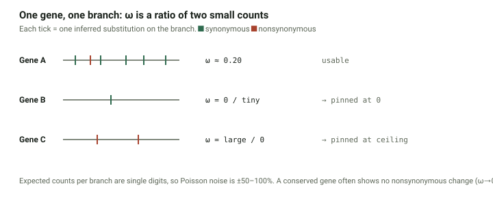
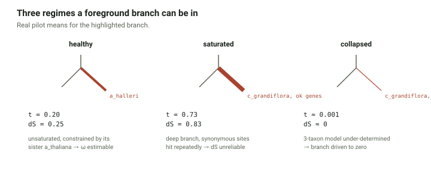
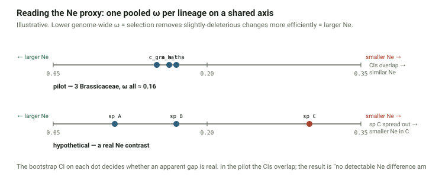

# A molecular-evolution primer for BUSCOmega

This is the ground-up "why" behind the pipeline. Read it once; the design
choices in `methods.md` and the code all follow from what's here.

---

## 1. The one-paragraph version

BUSCOmega estimates, for each species in a clade, **how efficiently natural
selection removes harmful amino-acid changes from that species' genome**. It
does this by measuring the ratio of protein-changing to protein-silent
substitution rates (**dN/dS**, called **ω**) across hundreds of conserved
single-copy genes, on that species' own branch of the tree. A species where
selection works efficiently shows a low ω; a species where drift is stronger
shows a higher ω. Because selection efficiency is governed by **effective
population size (Ne)**, genome-wide ω is a usable *proxy* for Ne — which is
the number the downstream analysis (H3, H5) actually wants.

---

## 2. dN, dS, and ω — from scratch

A protein-coding gene evolves by nucleotide substitutions in its codons.
Split every substitution into two kinds:

- **Synonymous (silent)**: changes the codon but not the amino acid
  (`GCU → GCC`, both = Alanine). The protein is unchanged, so natural
  selection acting *on protein function* can't see it. Treated as an
  approximately neutral yardstick for "how fast is this sequence mutating
  and drifting."
- **Nonsynonymous (replacement)**: changes the amino acid (`GCU → GUU`,
  Ala → Val). Selection on protein function *can* see it.

Now turn counts into rates:

- **dS** = synonymous substitutions per synonymous site (`S` sites)
- **dN** = nonsynonymous substitutions per nonsynonymous site (`N` sites)

(The normalization by `N` and `S` matters — a random codon has more ways to
change nonsynonymously than synonymously, so you can't just compare raw
counts.)

- **ω = dN / dS**

Interpretation:

| ω | meaning | how common |
|---|---|---|
| **ω < 1** | purifying (negative) selection — replacement changes are being removed | the overwhelming majority of genes, most of the time |
| **ω ≈ 1** | neutral — replacement changes tolerated as freely as silent ones | some genes, some sites, relaxed constraint |
| **ω > 1** | positive (diversifying) selection — replacement changes favored and fixed *faster* than the neutral rate | rare, usually episodic, usually only at a few sites |

The key move: **dS is the control.** It absorbs whatever the local mutation
rate and drift are doing. Dividing dN by dS asks "given how fast this
sequence is changing overall, is it changing its *protein* faster or slower
than you'd expect if the protein didn't matter?"

---

## 3. Why ω is a proxy for Ne — nearly-neutral theory

Most new nonsynonymous mutations aren't lethal and aren't beneficial — they
are **slightly deleterious** (a small nudge down in fitness). Whether
selection actually removes a slightly deleterious mutation, or whether it
just drifts around and sometimes fixes by chance, depends on one product:

> **Ne · s** — effective population size × the selection coefficient

- If **Ne · s ≫ 1**: selection dominates. The mutation is efficiently
  purged. It rarely fixes.
- If **Ne · s ≪ 1**: drift dominates. The mutation behaves *as if neutral*.
  It fixes at roughly the neutral rate.

`s` (how harmful the mutation is) is a property of the mutation, not the
species. `Ne` is a property of the species. So for the same pool of
slightly-deleterious mutations:

- **Large-Ne species** → more mutations fall in the "selection dominates"
  zone → fewer fix → **lower dN → lower ω**
- **Small-Ne species** → more mutations fall in the "drift dominates" zone →
  more fix as effectively neutral → **higher dN → higher ω**

Averaged over hundreds of genes that are mostly under purifying selection,
**genome-wide ω moves inversely with Ne.** That's the proxy.

Modern framing: the **drift barrier** (Lynch). There's a floor on how
weakly-deleterious a mutation can be while still being removable by
selection; that floor is set by `1/Ne`. Smaller Ne raises the barrier, so
more slightly-bad changes slip through, and ω creeps up.

**Caveats to keep honest about (these go in the paper's limitations):**

- ω also depends on the *distribution of fitness effects* (how deleterious
  new mutations tend to be) and on mutational biases, not Ne alone. It's a
  proxy, not a measurement.
- The Ne signal is cleanest in the **nearly-neutral zone** of the fitness
  spectrum. Strongly deleterious mutations are removed regardless of Ne;
  strongly beneficial ones fix regardless. It's the marginal, slightly-bad
  mutations that carry the Ne information.
- Best used **comparatively, within a clade** — closely related species
  share a similar distribution of fitness effects and codon usage, so
  differences in ω between them are more plausibly about Ne. This is exactly
  why BUSCOmega is clade-scoped and not a pan-eukaryote tool.

Key literature: Ohta (1973, 1992) — nearly-neutral theory; Kimura (1983) —
the neutral theory it extends; Lynch (2007, 2011) — the drift-barrier
synthesis; **Gossmann et al. (2010, MBE)** — genome-wide dN/dS as an
Ne-related signal across *plant* species specifically.

---

## 4. The codeml model families — which question does each answer?

codeml (from PAML) fits ω under different assumptions about *what ω is
allowed to vary across*. Three axes: across sites, across branches, or both.

| model family | ω varies across… | the question it answers | gives you |
|---|---|---|---|
| **M0** (one-ratio) | nothing — one ω for the whole gene, whole tree | "what's the average selective pressure on this gene?" | 1 number per gene |
| **Branch models** (`model=1` free-ratio; `model=2` two-ratio) | **branches** (lineages), same across all sites | "does selective pressure on this gene differ *between lineages*?" | 1 ω per branch (free-ratio), or foreground vs. background (two-ratio) |
| **Site models** (`NSsites 0 1 2 7 8` → M0, M1a, M2a, M7, M8) | **sites** (codons), same across all branches | "does this gene have *some codons* under positive selection, anywhere on the tree?" | site classes + a yes/no on positive selection (via LRT) |
| **Branch-site model** (model A) | **both** — specific sites, on a specific labelled branch | "did specific residues of this gene switch to positive selection *on one particular lineage*?" | the most targeted positive-selection test |

**Answering your question directly:** site models (M1a/M2a, M7/M8) tell you
*whether* a gene has positively-selected sites — they do **not** tell you
*which species/lineage*. They're tree-wide: one set of site classes applied
across the whole tree. "Which lineage" is a **branch** or **branch-site**
question, not a site-model question. So your recollection was half-right:
site models = "is this gene adaptively evolving at some residues," full
stop; the "in what species" part needs a different model.

### How the site-model test actually works (for reference)

You fit a pair of models and compare their likelihoods:

- **M1a** (nearly neutral): sites are either conserved (ω₀ < 1) or neutral
  (ω₁ = 1). No positive selection allowed.
- **M2a** (positive selection): M1a + a third class with ω₂ > 1.
- **M7** (beta): ω drawn from a beta distribution confined to [0, 1].
- **M8** (beta + ω): M7 + a class with ω > 1.

A likelihood-ratio test of **M2a vs M1a** (and **M8 vs M7**) asks whether
allowing ω > 1 for some sites fits the data significantly better. If yes →
evidence the gene has adaptively evolving residues.

---

## 5. What BUSCOmega actually runs, and why

**For the Ne proxy (the whole point):**

- **Two-ratio branch model (`model=2`)**, run once per focal species per
  gene: that species' terminal branch is labelled foreground, everything
  else is one shared background. This yields **one ω for that species' own
  lineage**, per gene. Aggregate across all the BUSCO genes → the
  species-level ω that stands in for Ne.
- **M0 per gene** as well — cheap, and it's the null for a sanity check: a
  likelihood-ratio test of the two-ratio model against M0 asks "is this
  species' branch actually evolving differently from the tree average for
  this gene, or not?" If two-ratio isn't a better fit, that gene's
  per-species ω isn't really distinguishable from the average anyway.

**Not run by default (kept as an optional mode):**

- **Site models** — they answer the positive-selection-at-residues question,
  which is a *different scientific question* from selection efficiency. A
  user who wants that can turn the mode on; the Ne proxy doesn't use it.

---

## 6. Why BUSCO genes specifically

Three properties, all of which matter here:

1. **Single-copy** — no paralogs to confuse for orthologs, so the alignment
   is genuinely comparing the same gene across species.
2. **Universal / conserved** — present in essentially every species in the
   lineage, so there's a large *common* set to work from. (`brassicales_odb10`
   has 4,596 markers; the common single-copy subset across a set of
   Brassicaceae is typically a few thousand.)
3. **Mostly under strong purifying selection** — which is the point. You're
   trying to measure *how efficiently purifying selection operates*, so you
   want a gene set that is actually under purifying selection. Fast-evolving
   or lineage-specific genes would add noise from a different process.

---

## 7. Why two-ratio and not free-ratio, at 23 taxa

Each gene alignment carries a **fixed, small amount of information** — a few
hundred codons, so only so many substitutions to learn from. Every ω you ask
codeml to estimate has to be "paid for" out of that budget.

- **Free-ratio** estimates a separate ω for *every branch at once*. A
  3-species tree has 4 branches — tight, but workable. A 23-species tree has
  ~43 branches — the same few hundred codons now has to support ~10× as many
  free parameters. Result: unstable estimates, and lots of branches where dS
  came out near zero so ω is mathematically undefined (PAML reports these as
  `999` or `0.0001` — you saw both in the pilot output).
- **Two-ratio** estimates *two* ω values (focal + background) no matter how
  big the tree is. The background ω is supported by every other branch
  pooled together, so it's well-constrained, which frees up the data to pin
  down the focal branch. Stable regardless of taxon count.

That's the whole reason for the choice. It costs more codeml runs (one per
focal species instead of one total), but each estimate is trustworthy.

---

## 8. Summarising ω across genes — why the estimator matters

BUSCOmega runs codeml per gene and gets, for each of ~370 (pilot) or
~4,600 (full) genes, an ω on the focal lineage's branch. Stage 7 has to
turn those into **one number per lineage** — the Ne proxy. The obvious
move, averaging the per-gene ω, is wrong, and it is worth understanding
exactly why before reading Stage 7's output.

### 8.1 The problem: ω from one gene is a ratio of two small counts

On a single terminal branch, for one ~400-codon gene, the *number of
substitutions that actually occurred* is small — usually single digits for
each of the synonymous and nonsynonymous classes. Substitution counts are
approximately Poisson, so a true expectation of 3 is observed as anything
from 0 to 8. ω = dN/dS divides one such noisy small count (per site) by
another.

Two failure modes dominate, and both are common:

- **A conserved gene** (BUSCO genes are, by construction) often shows
  **zero nonsynonymous substitutions** on a branch → dN = 0 → ω pinned at
  its lower bound (`omega_boundary` in the QC column).
- **A short branch** often shows **zero synonymous substitutions** → dS = 0
  → ω → ∞, pinned at codeml's ceiling (`ds_floor`, since dS is at the
  floor).

### 8.2 The problem gets structured, not just noisy

Whether a branch lands in trouble depends on how much it has diverged. The
pilot's three-taxon tree `(c_grandiflora, (a_halleri, a_thaliana))` shows
all three regimes:

- **Healthy** — *a_halleri*'s terminal branch (`t ≈ 0.20`, `dS ≈ 0.25`):
  moderate divergence, synonymous sites not saturated, and the close sister
  *a_thaliana* constrains the estimate. 97 % of its genes give a clean ω.
- **Saturated** — *c_grandiflora*'s branch where it *is* estimable
  (`t ≈ 0.73`, `dS ≈ 0.83`): synonymous sites over the ~10-My split have
  been hit repeatedly; the multiple-hits correction is stretched and dS,
  the denominator, becomes unreliable.
- **Collapsed** — for ~60 % of genes, the three-taxon two-ratio model is
  under-determined (separate foreground ω, background ω, branch lengths, κ
  from one short gene) and the optimiser drives the foreground branch to
  `t ≈ 0`.

Result on the pilot: for *c_grandiflora* as foreground, **93 genes at
ω ≈ 0 and 110 at the ceiling** — 55 % of genes at a bound.

### 8.3 What this does to each summary statistic (real pilot numbers)

| lineage (2-ratio foreground) | mean ω | median ω | **count-pooled ω** (95% CI) |
|---|---|---|---|
| a_halleri | 5.6 | 0.14 | **0.163** (0.152–0.174) |
| a_thaliana | 3.0 | 0.15 | **0.170** (0.158–0.183) |
| c_grandiflora | **226** | 0.18 | **0.151** (0.135–0.165) |

- **Mean** is destroyed by the handful of genes at the ω-ceiling
  (each ≈ 999). 5.6 and 226 are not estimates of anything.
- **Median** actually holds up here (0.14–0.18) — it survives the ceiling
  and the pile-up at 0. But it discards the fact that a gene with 40
  substitutions is worth more than a gene with 2, and it has no built-in
  guard against a pathological gene: the pilot's a_halleri set contained
  **one gene with dS ≈ 70** (a mis-alignment, not real divergence).
- **Count-pooled ω** (0.15–0.17, with the dS ceiling removing the dS ≈ 70
  gene and its kin) lands close to the median here *and* is the principled
  estimator: it weights each gene by how much substitution it carries, it
  degrades gracefully if the boundary pile-up grows, and the dS-ceiling
  step that comes with it caught real garbage on the pilot. The three
  lineages' CIs mostly overlap → no detectable Nₑ difference among these
  close relatives, which is the expected result.

### 8.4 The options

| estimator | formula | assumes | implication |
|---|---|---|---|
| mean of per-gene ω | (1/n) Σ ωɡ | every gene equally informative; each ωɡ well estimated | dominated by the boundary pile-up and the ceiling tail; uninterpretable here |
| median of per-gene ω | median(ωɡ) | a robust centre is what you want | ignores per-gene information content; carries no CI; no guard against a single pathological gene |
| **count-pooled ω** | [Σ(Nɡ·dNɡ) ⁄ ΣNɡ] ⁄ [Σ(Sɡ·dSɡ) ⁄ ΣSɡ] | pool synonymous and nonsynonymous *sites* and *substitutions* across genes, divide once | the concatenation-equivalent estimate; genes weighted by the substitution they carry; boundary genes self-down-weight |
| synonymous-weighted mean of ωɡ | Σ(wɡ ωɡ) ⁄ Σ wɡ, wɡ = Sɡ·dSɡ | a close approximation that keeps a per-gene structure | ≈ pooled; convenient for diagnostics |

Note the pooled formula is **not** `Σ(N·dN) / Σ(S·dS)` — that is *total
nonsynonymous substitutions ⁄ total synonymous substitutions*, which is
~3× too high because there are ~3× more nonsynonymous sites. Sites and
substitutions are each summed, then the two rates are divided.

### 8.5 Recommended: count-pooled ω, with a dS ceiling and a gene bootstrap

- **Count-pooled ω is the estimator.** It combines independent per-gene
  observations of the same underlying rate ratio the way a concatenated
  analysis would; the mean and median are not estimators of that ratio when
  the per-gene ω are boundary-dominated.
- **dS ceiling** (default 1.5, `--ds-ceiling`): drop a gene's contribution
  to a lineage when its dS there exceeds ~1.5. This covers two things at
  once — genuine synonymous saturation on deep branches, *and* the
  occasional mis-aligned gene whose dS comes back at 30–70. On the pilot,
  removing one dS ≈ 70 gene moved a_halleri's pooled ω from ~0.035 to
  0.163; it is not a light safeguard.
- **Keep the boundary genes** (`omega_boundary`, ω at 0 or 999). Under
  pooling they add ≈ 0 to the numerator and a real amount to the
  denominator — they pull ω down slightly but that is real signal.
- **Drop `ds_floor` genes** (dS below ~1e-3): no synonymous signal on that
  branch, so they add nonsynonymous substitution to the pool with no
  matching denominator — a net upward bias.
- **Gene bootstrap** for the interval (`--bootstrap`, default 1000):
  resample genes with replacement, recompute pooled ω, take the 2.5 / 97.5
  percentiles.

### 8.6 Reading your own Stage 7 output

- The per-gene ω distribution (`per_gene_omega.tsv`) should show a bulk
  near the pooled value plus some pile-up at 0 for the most conserved
  genes. A **large** pile-up at *both* 0 and the ceiling, as for
  *c_grandiflora*, means that lineage's branch is deep (saturation) or
  weakly constrained (few taxa) — trust the pooled number, not the shape.
- Compare the pooled 2-ratio ω to the **M0 tree-wide ω**. They should be in
  the same ballpark; a large gap means the two-ratio model is straining on
  that lineage.
- A high `n_excluded` (the dS ceiling biting many genes) flags a deep
  lineage. The proxy is still usable — note it in the write-up.

### 8.7 Should the script decide, or the user?

- The **estimator** is not a user choice. Averaging ratios is simply the
  wrong operation here, and offering it as a flag would invite
  mis-analysis. Stage 7 computes the pooled ω and *also* prints the mean
  and median in the output, purely so the difference is visible.
- The **dS ceiling** and the **bootstrap count** *are* exposed
  (`--ds-ceiling`, `--bootstrap`), because they are legitimate choices that
  depend on how deep your clade is.
- This matches the rest of BUSCOmega: the method is fixed and defended in
  these docs; the knobs that genuinely depend on your data are flags.

### 8.8 The gene bootstrap, and why it (not a standard error)

You have ~370 (or ~4,600) genes. They are a *sample* of the genes that
could have been used. The pooled ω you computed would come out a little
differently if you had happened to sample a different set of genes — and
you want to report that wobble as a confidence interval.

The **gene bootstrap** estimates it without any distributional assumption:

1. draw a new set of the same number of genes, **with replacement**, from
   your gene list (some genes appear twice, some not at all);
2. recompute the pooled ω from that resampled set;
3. repeat 1–2 many times (default 1000);
4. the 2.5th and 97.5th percentiles of those recomputed values are the
   95 % CI.

**Why not the textbook `SD / √n`?** That is the standard error *of a mean*.
The pooled ω is not a mean of per-gene ω — it is a ratio of two sums. And
the per-gene ω are heavy-tailed and boundary-piled (§8.3), so their SD is
not a meaningful quantity. The bootstrap sidesteps both problems: it
resamples the genes and re-does the exact pooling operation, so whatever
the estimator actually is, the interval is honest about it.

**What the CI is for:** deciding whether an apparent ω difference between
two lineages is real. If lineage A's CI and lineage B's CI overlap
substantially, you have no evidence their Nₑ differ — regardless of the
point estimates.

---

## 9. Interpreting the result — from pooled ω to an Nₑ statement

Stage 7 gives you **one pooled ω per lineage**, each with a bootstrap CI,
on a single axis:

### 9.1 The direction

From §3: genome-wide ω over conserved genes moves **inversely** with Nₑ.
Lower ω → selection is removing slightly-deleterious amino-acid changes
efficiently → larger Nₑ. Higher ω → more of those changes drift to fixation
→ smaller Nₑ. So you **rank** lineages by ω and read Nₑ off in the opposite
order.

### 9.2 Do you get a number for every species, or have to choose?

**Every species, one number each, and it is not a choice.** Each species'
proxy is the **foreground (`#1`) branch ω from that species' own 2-ratio
run**. You run one 2-ratio analysis per species; each yields its focal
species' terminal-branch ω plus a single pooled "background" ω for every
other branch. You take the foreground value from each run. Twenty-one
ingroup species → twenty-one proxy values, a complete set. The background
ω is a nuisance parameter — you can check the background values are
mutually consistent as a sanity test, but you do not report them.

(Internal branches — ancestral lineages — get the background ω here,
because Stage 4 only labels terminal branches. Labelling an internal branch
`#1` would give you an ancestral-lineage ω, but the Nₑ proxy is about
*extant* species, so that is not done.)

### 9.3 What the pilot result actually says

Pooled ω, with 95 % gene-bootstrap CI:

| species | pooled ω | 95 % CI | genes used | M0 |
|---|---|---|---|---|
| a_halleri | 0.163 | 0.152 – 0.174 | 368 (−1 dS>1.5) | 0.158 |
| a_thaliana | 0.170 | 0.158 – 0.183 | 368 (−1) | 0.158 |
| c_grandiflora | 0.151 | 0.135 – 0.165 | 314 (−53 ds_floor, −2 dS>1.5) | 0.158 |

Three readings, all worth stating:

1. **ω ≈ 0.15–0.17 means moderate-to-strong purifying selection** — dN is
   ~15–17 % of dS. Well below 1, as conserved single-copy orthologs should
   be. A check that the pipeline behaves, not a finding.
2. **The three CIs mostly overlap** (a_thaliana and c_grandiflora only
   marginally) → *no strong Nₑ difference among these three Brassicaceae*.
   Expected: close relatives, similar life history. Real contrasts, if any,
   appear at the 21-taxon scale.
3. **The filter matters.** a_halleri and a_thaliana each had one gene with
   dS ≈ 70 — a mis-alignment, not divergence — that on its own dragged the
   naive pooled ω down to ~0.035. The `--ds-ceiling` step removed it.
   c_grandiflora additionally lost 53 genes with no synonymous signal
   (`ds_floor`). Always report `n_genes` and the exclusions.

The mean (5.6, 3.0, 226) and median (0.14, 0.15, 0.18) sit next to the
pooled value in the output only to show the contrast — the mean is an
artefact of the ω-ceiling genes; the median happens to track the pooled
value here but carries no CI and no pathology guard.

### 9.4 Writing it up

- Hedge the causal step: "genome-wide ω **suggests** [not *shows*] lower
  Nₑ in lineage X" — ω is a proxy, and depends on the distribution of
  fitness effects and mutational biases as well as Nₑ (§3).
- Always carry the CI, and say "overlapping CIs → no significant
  difference" explicitly rather than implying a difference from point
  estimates.
- State the QC context for deep lineages: "*n* = *k* genes excluded by the
  dS ≥ 1.5 ceiling for lineage X (synonymous saturation)."

---

## 10. What codeml needs as input

Per gene:

1. A **codon alignment** — nucleotides, strictly in reading frame, gaps in
   whole-codon units, one file per gene with every species as a record.
   (BUSCOmega builds this: protein-align with MAFFT, then back-translate
   onto the CDS with PAL2NAL.)
2. A **species tree** — topology only; codeml estimates the branch lengths.
   For the two-ratio model, one copy of the tree per focal species with that
   species' branch tagged `#1`.
3. A **control file** (`.ctrl`) — plain text, tells codeml which model,
   which starting values, how to handle ambiguous columns (`cleandata`).

---

## 11. References

- Kimura, M. (1983). *The Neutral Theory of Molecular Evolution.*
- Ohta, T. (1973). Slightly deleterious mutant substitutions in evolution. *Nature.*
- Ohta, T. (1992). The nearly neutral theory of molecular evolution. *Annu. Rev. Ecol. Syst.*
- Lynch, M. (2007). *The Origins of Genome Architecture* — drift-barrier hypothesis.
- Gossmann, T.I. et al. (2010). Genome-wide analyses reveal little evidence for adaptive evolution in many plant species. *Mol. Biol. Evol.*
- Yang, Z. (2007). PAML 4: phylogenetic analysis by maximum likelihood. *Mol. Biol. Evol.* — the codeml models above.
- Yang, Z. & Nielsen, R. (2000). Estimating synonymous and nonsynonymous substitution rates under realistic evolutionary models. *Mol. Biol. Evol.* — the ML dN/dS estimator codeml uses.
- Álvarez-Carretero, S., Kapli, P., Yang, Z. (2023). Beginner's guide to codon models. *Mol. Biol. Evol.* — a good modern walkthrough of M0 / branch / site / branch-site.
- Section 8's pooled (concatenation-equivalent) estimator and within-clade comparison follow standard practice for genome-wide dN/dS; Gossmann et al. (2010), above, applies it to plants.

---

## Appendix — glossary

**Selection and population genetics**

| term | definition |
|---|---|
| **synonymous (silent) substitution** | a nucleotide change in a codon that leaves the amino acid unchanged (`GCU→GCC`, both Ala). Invisible to selection on protein function. |
| **nonsynonymous (replacement) substitution** | a codon change that alters the amino acid (`GCU→GUU`, Ala→Val). Visible to selection on protein function. |
| **dS** | synonymous substitutions per synonymous site on a branch. The near-neutral yardstick for local mutation rate + drift. |
| **dN** | nonsynonymous substitutions per nonsynonymous site on a branch. |
| **N sites / S sites** | the number of nonsynonymous / synonymous *positions* in the gene (a codon contributes fractionally to each). dN and dS are normalised by these. |
| **ω (omega) = dN/dS** | the ratio. ω<1 purifying selection, ω≈1 neutral / relaxed, ω>1 positive selection. |
| **purifying (negative) selection** | selection removing deleterious (usually protein-changing) variants. The default state of a conserved gene. ω<1. |
| **positive (diversifying) selection** | selection favouring and fixing protein-changing variants faster than neutral. ω>1, usually only at a few sites, episodically. |
| **relaxed / neutral evolution** | constraint has weakened; replacement changes accumulate about as freely as silent ones. ω≈1. |
| **Nₑ (effective population size)** | the size of an idealised population that would drift at the same rate as the real one. Governs how efficiently selection acts. |
| **slightly deleterious mutation** | a variant with a small fitness cost — the class whose fate depends on Nₑ·s, and which therefore carries the Nₑ signal. |
| **nearly-neutral theory** (Ohta) | the extension of neutral theory in which slightly-deleterious mutations behave neutrally when Nₑ·s ≪ 1 and are purged when Nₑ·s ≫ 1. |
| **drift barrier** (Lynch) | the idea that selection cannot refine a trait past the point where the remaining gains are smaller than ~1/Nₑ; smaller Nₑ raises the barrier, so ω creeps up. |
| **distribution of fitness effects (DFE)** | how new mutations are spread across fitness costs. ω depends on the DFE as well as on Nₑ — one reason ω is a proxy, not a measurement. |
| **saturation** | over a long branch, synonymous sites have been hit multiple times; the observed count undercounts the real one and the multiple-hits correction becomes unstable. Makes dS (hence ω) unreliable. |

**codeml / PAML**

| term | definition |
|---|---|
| **PAML** | Phylogenetic Analysis by Maximum Likelihood (Yang). The software suite. |
| **codeml** | the PAML program that fits codon substitution models and estimates dN, dS, ω. |
| **M0 (one-ratio)** | `model=0`: a single ω for the whole gene on the whole tree. BUSCOmega's baseline / null. |
| **branch model** | ω is allowed to differ *between branches* (lineages), the same across all codons. |
| **free-ratio** (`model=1`) | a branch model with a separate ω on *every* branch. Many parameters, noisy on single genes — BUSCOmega does not use it. |
| **two-ratio** (`model=2`) | a branch model with exactly two ω classes: the labelled "foreground" branch, and everything else ("background"). BUSCOmega's engine. |
| **site model** | ω differs *between codons*, the same across all branches. Tests for positively-selected sites; tree-wide, so it can't say *which lineage*. |
| **branch-site model** | ω differs across both specific codons and a specific labelled branch. The most targeted positive-selection test. |
| **foreground / background branch** | in a two-ratio (or branch-site) run, the branch tagged `#1` in the tree file (foreground) vs all others (background). |
| **`#1` label** | the marker appended to a tip name in the Newick file to make that branch the foreground. |
| **t (branch length)** | codeml's estimate of the expected number of nucleotide substitutions per codon along a branch. Bundles synonymous + nonsynonymous change. |
| **cleandata** | codeml option: `1` deletes any codon column with a gap/ambiguity in any sequence before fitting; `0` keeps them as missing data. BUSCOmega uses `1` everywhere for comparability. |
| **ndata** | codeml option: analyse *N* alignments from one file in sequence. How BUSCOmega batches genes; results are identical to running them singly. |
| **LRT (likelihood-ratio test)** | comparing two nested models by twice the difference in log-likelihood against a χ² distribution; e.g. two-ratio vs M0. |

**Estimator terms (§8–9)**

| term | definition |
|---|---|
| **count-pooled ω** | the lineage's Nₑ proxy: `[Σ(N·dN)/ΣN] / [Σ(S·dS)/ΣS]` over genes — pool synonymous and nonsynonymous sites and substitutions separately, then divide the two rates once. Equivalent to analysing all genes as one concatenated matrix. |
| **mean of per-gene ω** | `(1/n)Σωɡ`. Wrong here — dominated by genes whose ω is pinned at the ceiling. |
| **median of per-gene ω** | the middle per-gene ω. Robust to the ceiling but distorted by the pile-up at 0 and blind to per-gene information content. |
| **dS ceiling** (`--ds-ceiling`, default 1.5) | drop a gene's contribution to a lineage when its dS on that lineage exceeds the ceiling (synonymous saturation). |
| **gene bootstrap** (`--bootstrap`, default 1000) | resample genes with replacement, recompute pooled ω each time; the 2.5/97.5 percentiles are the 95 % CI. |
| **QC flag** | per-branch-record note from Stage 6: `omega_boundary` (ω at codeml's lower/upper bound), `ds_floor` (dS at the floor, ω unreliable), `ok`. |

**BUSCO**

| term | definition |
|---|---|
| **BUSCO** | Benchmarking Universal Single-Copy Orthologs — a tool + a set of lineage-specific marker genes expected once in each genome of that lineage. |
| **SCO** | single-copy ortholog. BUSCOmega's Stage 1 keeps genes that are single-copy and complete in *every* species. |
| **lineage dataset / odbNN** | the marker set for a clade (`brassicales_odb10`, `fungi_odb10`, …). `odb10` vs `odb12` = OrthoDB release. |
| **full_table.tsv** | BUSCO's per-genome output: one row per marker with status `Complete` / `Duplicated` / `Fragmented` / `Missing` and the matched sequence ID. |
| **codon alignment** | a nucleotide alignment kept strictly in reading frame, gaps in whole-codon units. BUSCOmega builds it by aligning proteins (MAFFT) then imposing that on the CDS (PAL2NAL). |
